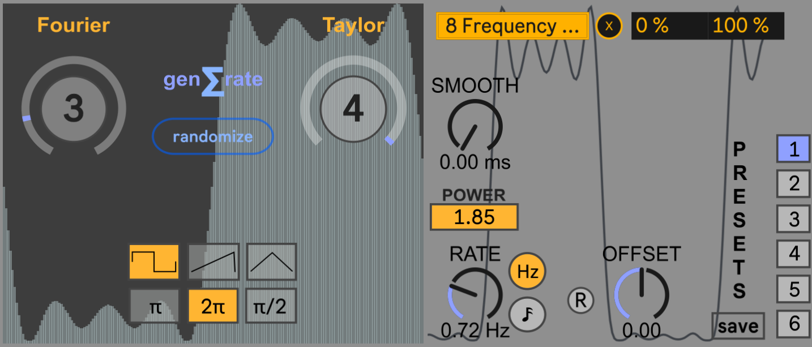

# Desinr LFO for Max4Live

## Overview

Desinr LFO is a Max4Live device designed to generate unique Low-Frequency Oscillator waveforms that can be mapped to control parameters within Ableton Live. Unlike traditional LFO generators, Desinr LFO intentionally approximates waveforms with imperfections, resulting in interesting and broken forms that often exhibit intrinsic rhythmic qualities.

  

## Features

- **Fine-tune harmonics relevance:** Control the accuracy of the approximation via Fourier series to adjust the significance and density of harmonics in waveform generation.
- **Adjust sinuisodal shape:** Choose the degree of approximation of the Taylor series to adjust the exactness and smoothness of the sinuisodal components.
- **Dynamic waveform shaping:** Utilize the POWER control to add versatility to waveform shaping.
- **Preset management:** Save and load presets for easy recall of favorite settings.

## Installation

1. Download the `Desinr LFO` folder from the repository.
2. Place the folder in your 'Max Audio Effect' folder.

## Usage

1. Drag and drop the `desinr LFO.amdx` device onto a MIDI or audio track in Ableton Live.
2. Configure the parameters of the LFO waveform as desired.
3. Map the generated LFO waveform to control various parameters within Ableton Live.
